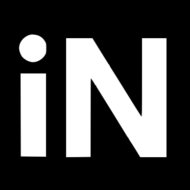

# Olá! 😎

Sou William Jouse, Doutor em Cosmologia e Físico formado pela Universidade Federal do Rio Grande do Norte. Atualmente estou em transição de carreira para área de Ciências de Dados. Acredito que a informação, a tecnologia, a ciência e a educação podem nos guiar para resolver muitos problemas disponíveis. Sou entusiasta do uso de *machine learning* em conjunto com dados podem nos ajudar a resolver problemas. 

Meu doutorado em Cosmologia foi obtido pela Universidade Federal do Rio Grando do Norte. Meus interesses acadêmicos durante esse período foram [modelos cosmológicos alternativos e análise estatística Bayesiana de modelos cosmológicos](https://repositorio.ufrn.br/bitstream/123456789/29691/1/Vinculosobservacionaismodelos_Silva_2019.pdf). Atualmente tenho me dedicado ao estudo de técnicas de aprendizagem de máquina e análise de dados.

Nesse repositório está documentado os projetos que tenho desevolvidos nos últimos meses. Alguns projetos estão em inglês e outros em português.

- 💡 Competências e Habilidade: Python, Análise Exploratória de dados, vizualização de dados, análise de dados, estatística Bayesiana e escrita científica.
- ⚡️ Atualmente: Aprendendo sobre técnicas de *machine learning*.

## 💻 Projetos

### Projetos de Estatística e *Machine Learning*

- [Regression Models](https://github.com/williamjouse/Regression-Models)
- [Classification Models](https://github.com/williamjouse/Classification-models)
- [Clustering Models and Dimension Reduction](Soon)

### Análise exploratória de dados

- [Prog Archives Web Scraping and Exploratory Data Analysis](https://github.com/williamjouse/Prog_archives_scraping)
- [Understanding Cities and Federative Units of Brazil](https://github.com/williamjouse/Cities_Brazil)
- [Analysis of Activities from Garmin Connect Using Python](https://github.com/williamjouse/Garmin_analysis)
- [Uber Trips Exploration Analysis](https://github.com/williamjouse/Uber_trips_EDA)

### Lado B

- [Comparison of different integration methods in the statistical analysis of supernova and baryon acoustic oscillations](https://github.com/williamjouse/LCDM)
- [Flamengo Matches in 2023](https://github.com/williamjouse/jogos-Flamengo-2023)

&nbsp;&nbsp;
&nbsp;&nbsp;
&nbsp;&nbsp;
&nbsp;&nbsp;
&nbsp;&nbsp;

  

